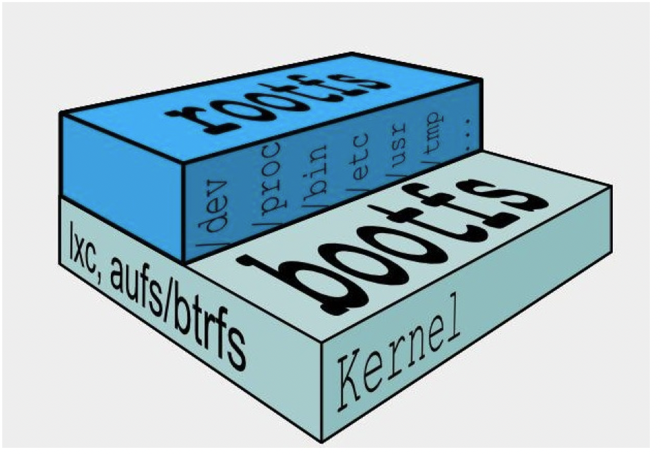

## 基本介绍

> 镜像

是一种轻量级、可执行的独立软件包，它包含运行某个软件所需的所有内容，我们把应用程序和配置依赖打包好形成一个可交付的运行环境(包括代码、运行时需要的库、环境变量和配置文件等)，这个打包好的运行环境就是image镜像文件。
只有通过这个镜像文件才能生成Docker容器实例(类似Python中new出来一个对象)。

> 分层镜像

以我们的pull为例，在下载的过程中我们可以看到docker的镜像好像是在一层一层的在下载 。

docker的镜像实际上由一层一层的文件系统组成，这种层级的文件系统UnionFS。

> UnionFS（联合文件系统）

UnionFS（联合文件系统）：Union文件系统（UnionFS）是一种分层、轻量级并且高性能的文件系统，它支持 对文件系统的修改作为一次提交来一层层的叠加， 同时可以将不同目录挂载到同一个虚拟文件系统下(unite several directories into a single virtual filesystem)。

Union 文件系统是 Docker 镜像的基础。

镜像可以通过分层来进行继承 ，基于基础镜像（没有父镜像），可以制作各种具体的应用镜像。

特性：一次同时加载多个文件系统，但从外面看起来，只能看到一个文件系统，联合加载会把各层文件系统叠加起来，这样最终的文件系统会包含所有底层的文件和目录

> Docker镜像加载原理

bootfs(boot file system)主要包含bootloader和kernel, bootloader主要是引导加载kernel, Linux刚启动时会加载bootfs文件系统， 在Docker镜像的最底层是引导文件系统bootfs。 这一层与我们典型的Linux/Unix系统是一样的，包含boot加载器和内核。当boot加载完成之后整个内核就都在内存中了，此时内存的使用权已由bootfs转交给内核，此时系统也会卸载bootfs。

rootfs (root file system) ，在bootfs之上 。包含的就是典型 Linux 系统中的 /dev, /proc, /bin, /etc 等标准目录和文件。rootfs就是各种不同的操作系统发行版，比如Ubuntu，Centos等等。



平时我们安装进虚拟机的CentOS都是好几个G，为什么docker这里才200多M？？

```console
$ docker images
REPOSITORY                   TAG       IMAGE ID       CREATED         SIZE
centos                       latest    5d0da3dc9764   2 years ago     231MB
```

对于一个精简的OS，rootfs可以很小，只需要包括最基本的命令、工具和程序库就可以了，因为底层直接用Host的kernel，自己只需要提供 rootfs 就行了。由此可见对于不同的linux发行版, bootfs基本是一致的, rootfs会有差别, 因此不同的发行版可以公用bootfs。

> 为什么Docker镜像要采用这种分层结构呢

镜像分层最大的一个好处就是共享资源，方便复制迁移，就是为了复用。

比如说有多个镜像都从相同的 base 镜像构建而来，那么 Docker Host 只需在磁盘上保存一份 base 镜像；
同时内存中也只需加载一份 base 镜像，就可以为所有容器服务了。而且镜像的每一层都可以被共享。

Docker镜像层都是只读的，容器层是可写的，当容器启动时，一个新的可写层被加载到镜像的顶部。这一层通常被称作"容器层"，"容器层"之下的都叫"镜像层"。

> 所有对容器的改动 - 无论添加、删除、还是修改文件都只会发生在容器层中。
>
> 只有容器层是可写的，容器层下面的所有镜像层都是只读的。


## 镜像commit案例

​`docker commit `​​​​提交容器副本使之成为一个新的镜像

> 基本语法

```shell
docker commit -m="提交的描述信息" -a="作者" 容器ID  要创建的目标镜像名:[标签名]
```

> 【案例演示】

从dockerHub上下ubuntu镜像到本地并成功运行，进入到容器内部

```shell
$ docker search ubuntu
NAME                             DESCRIPTION                                     STARS     OFFICIAL   AUTOMATED
ubuntu                           Ubuntu is a Debian-based Linux operating sys…   16215     [OK]
websphere-liberty                WebSphere Liberty multi-architecture images …   296       [OK]

$ docker pull ubuntu
Using default tag: latest
latest: Pulling from library/ubuntu
7b1a6ab2e44d: Pull complete
Digest: sha256:626ffe58f6e7566e00254b638eb7e0f3b11d4da9675088f4781a50ae288f3322
Status: Downloaded newer image for ubuntu:latest
docker.io/library/ubuntu:latest

$ docker run -dit --name ubuntu ubuntu:latest
5094a30794e6596dc5875c15fe557ac820021b37d195f5f8a48512520722a374

$ docker ps
CONTAINER ID   IMAGE           COMMAND   CREATED         STATUS         PORTS     NAMES
5094a30794e6   ubuntu:latest   "bash"    7 seconds ago   Up 5 seconds             ubuntu

$ docker exec -it ubuntu bash
root@5094a30794e6:/#
```

外网连通情况下，安装vim和net-tools

```shell
# 先更新我们的包管理工具
root@5094a30794e6:/# apt update
# 然后安装我们需要的vim
root@5094a30794e6:/# apt install -y net-tools
# 安装成功，推出容器
root@5094a30794e6:/# exit
```

commit我们自己的新镜像

```shell
$ docker commit -m "add vim and net-tools" -a "liusf" ubuntu liusf/ubuntu:latest
sha256:df42f957a0477413d352a09f0e56f6f756a9cc59477a190da63232af9f393cea

$ docker images
REPOSITORY       TAG       IMAGE ID       CREATED          SIZE
liusf/ubuntu     latest    df42f957a047   34 seconds ago   186MB
ubuntu           latest    ba6acccedd29   21 months ago    72.8MB
```

运行新容器测试

```shell
$ docker run -it liusf/ubuntu:latest bash

root@8cb0ed99553d:/# ifconfig
eth0: flags=4163<UP,BROADCAST,RUNNING,MULTICAST>  mtu 1500
        inet 172.17.0.3  netmask 255.255.0.0  broadcast 172.17.255.255
        ether 02:42:ac:11:00:03  txqueuelen 0  (Ethernet)
        RX packets 8  bytes 656 (656.0 B)
        RX errors 0  dropped 0  overruns 0  frame 0
        TX packets 0  bytes 0 (0.0 B)
        TX errors 0  dropped 0 overruns 0  carrier 0  collisions 0

lo: flags=73<UP,LOOPBACK,RUNNING>  mtu 65536
        inet 127.0.0.1  netmask 255.0.0.0
        loop  txqueuelen 1000  (Local Loopback)
        RX packets 0  bytes 0 (0.0 B)
        RX errors 0  dropped 0  overruns 0  frame 0
        TX packets 0  bytes 0 (0.0 B)
        TX errors 0  dropped 0 overruns 0  carrier 0  collisions 0
```

官网是默认下载的Ubuntu没有ifconfig命令

我们自己commit构建的镜像，新增加了net-tools功能，可以成功使用。

**总结**

Docker中的镜像分层， 支持通过扩展现有镜像，创建新的镜像 。

类似面向对象编程中继承于一个Base基础类，自己再按需扩展。
新镜像是从 base 镜像一层一层叠加生成的。每安装一个软件，就在现有镜像的基础上增加一层


## 虚悬镜像

**仓库名，标签都是**   **&lt;**​**none**​ **&gt;**   **的镜像，俗称dangling image**

```console
# 查看所有虚悬镜像
$ docker image ls -f dangling=true
REPOSITORY   TAG       IMAGE ID       CREATED              SIZE
<none>       <none>    5f0c194f1c9e   About a minute ago   101MB

# 删除虚悬镜像
$ docker image prune
WARNING! This will remove all dangling images.
Are you sure you want to continue? [y/N] y
Deleted Images:
deleted: sha256:5f0c194f1c9ec8002b0bb7a79fedd255be06c907cfc271efbbc44a53bbd9911f

Total reclaimed space: 0B

$ docker image ls -f dangling=true
REPOSITORY   TAG       IMAGE ID   CREATED   SIZE
```
