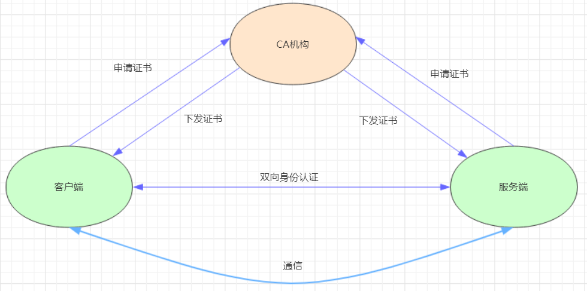

## 访问控制概述

Kubernetes作为一个分布式集群的管理工具，保证集群的安全性是其一个重要的任务。所谓的安全性其实就是保证对Kubernetes的各种**客户端**进行**认证和鉴权**操作。

**客户端**

在Kubernetes集群中，客户端通常有两类：

* **User Account**：一般是独立于kubernetes之外的其他服务管理的用户账号。
* **Service Account**：kubernetes管理的账号，用于为Pod中的服务进程在访问Kubernetes时提供身份标识。


**认证、授权与准入控制**

ApiServer是访问及管理资源对象的唯一入口。任何一个请求访问ApiServer，都要经过下面三个流程：

* Authentication（认证）：身份鉴别，只有正确的账号才能够通过认证
* Authorization（授权）： 判断用户是否有权限对访问的资源执行特定的动作
* Admission Control（准入控制）：用于补充授权机制以实现更加精细的访问控制功能。


## 认证管理

Kubernetes集群安全的最关键点在于如何识别并认证客户端身份，它提供了3种客户端身份认证方式：

* HTTP Base认证：通过用户名+密码的方式认证

  ```
      这种认证方式是把“用户名:密码”用BASE64算法进行编码后的字符串放在HTTP请求中的Header Authorization域里发送给服务端。服务端收到后进行解码，获取用户名及密码，然后进行用户身份认证的过程。
  ```
* HTTP Token认证：通过一个Token来识别合法用户

  ```
      这种认证方式是用一个很长的难以被模仿的字符串--Token来表明客户身份的一种方式。每个Token对应一个用户名，当客户端发起API调用请求时，需要在HTTP Header里放入Token，API Server接到Token后会跟服务器中保存的token进行比对，然后进行用户身份认证的过程。
  ```
* HTTPS证书认证：基于CA根证书签名的双向数字证书认证方式

  ```
      这种认证方式是安全性最高的一种方式，但是同时也是操作起来最麻烦的一种方式。
  ```



**HTTPS认证大体分为3个过程：**

1. 证书申请和下发

   ```
     HTTPS通信双方的服务器向CA机构申请证书，CA机构下发根证书、服务端证书及私钥给申请者
   ```
2. 客户端和服务端的双向认证

   ```
     1> 客户端向服务器端发起请求，服务端下发自己的证书给客户端，
        客户端接收到证书后，通过私钥解密证书，在证书中获得服务端的公钥，
        客户端利用服务器端的公钥认证证书中的信息，如果一致，则认可这个服务器
     2> 客户端发送自己的证书给服务器端，服务端接收到证书后，通过私钥解密证书，
        在证书中获得客户端的公钥，并用该公钥认证证书信息，确认客户端是否合法
   ```
3. 服务器端和客户端进行通信

   ```
     服务器端和客户端协商好加密方案后，客户端会产生一个随机的秘钥并加密，然后发送到服务器端。
     服务器端接收这个秘钥后，双方接下来通信的所有内容都通过该随机秘钥加密
   ```

> 注意: Kubernetes允许同时配置多种认证方式，只要其中任意一个方式认证通过即可

## 授权管理

授权发生在认证成功之后，通过认证就可以知道请求用户是谁， 然后Kubernetes会根据事先定义的授权策略来决定用户是否有权限访问，这个过程就称为授权。

每个发送到ApiServer的请求都带上了用户和资源的信息：比如发送请求的用户、请求的路径、请求的动作等，授权就是根据这些信息和授权策略进行比较，如果符合策略，则认为授权通过，否则会返回错误。

API Server目前支持以下几种授权策略：

* AlwaysDeny：表示拒绝所有请求，一般用于测试
* AlwaysAllow：允许接收所有请求，相当于集群不需要授权流程（Kubernetes默认的策略）
* ABAC：基于属性的访问控制，表示使用用户配置的授权规则对用户请求进行匹配和控制
* Webhook：通过调用外部REST服务对用户进行授权
* Node：是一种专用模式，用于对kubelet发出的请求进行访问控制
* RBAC：基于角色的访问控制（kubeadm安装方式下的默认选项）

RBAC(Role-Based Access Control) 基于角色的访问控制，主要是在描述一件事情：**给哪些对象授予了哪些权限**

其中涉及到了下面几个概念：

* 对象：User、Groups、ServiceAccount
* 角色：代表着一组定义在资源上的可操作动作(权限)的集合
* 绑定：将定义好的角色跟用户绑定在一起


RBAC引入了4个顶级资源对象：

* Role、ClusterRole：角色，用于指定一组权限
* RoleBinding、ClusterRoleBinding：角色绑定，用于将角色（权限）赋予给对象

**Role、ClusterRole**

一个角色就是一组权限的集合，这里的权限都是许可形式的（白名单）。

```yaml
# Role只能对命名空间内的资源进行授权，需要指定nameapce
kind: Role
apiVersion: rbac.authorization.k8s.io/v1beta1
metadata:
  namespace: dev
  name: authorization-role
rules:
- apiGroups: [""]  # 支持的API组列表,"" 空字符串，表示核心API群
  resources: ["pods"] # 支持的资源对象列表
  verbs: ["get", "watch", "list"] # 允许的对资源对象的操作方法列表
```

```yaml
# ClusterRole可以对集群范围内资源、跨namespaces的范围资源、非资源类型进行授权
kind: ClusterRole
apiVersion: rbac.authorization.k8s.io/v1beta1
metadata:
 name: authorization-clusterrole
rules:
- apiGroups: [""]
  resources: ["pods"]
  verbs: ["get", "watch", "list"]
```

需要详细说明的是，rules中的参数：

* apiGroups: 支持的API组列表

  ```bash
  "","apps", "autoscaling", "batch"
  ```
* resources：支持的资源对象列表

  ```bash
  "services", "endpoints", "pods","secrets","configmaps","crontabs","deployments","jobs",
  "nodes","rolebindings","clusterroles","daemonsets","replicasets","statefulsets",
  "horizontalpodautoscalers","replicationcontrollers","cronjobs"
  ```
* verbs：对资源对象的操作方法列表

  ```bash
  "get", "list", "watch", "create", "update", "patch", "delete", "exec"
  ```

**RoleBinding、ClusterRoleBinding**

角色绑定用来把一个角色绑定到一个目标对象上，绑定目标可以是User、Group或者ServiceAccount。

```yaml
# RoleBinding可以将同一namespace中的subject绑定到某个Role下，则此subject即具有该Role定义的权限
kind: RoleBinding
apiVersion: rbac.authorization.k8s.io/v1beta1
metadata:
  name: authorization-role-binding
  namespace: dev
subjects:
- kind: User
  name: heima
  apiGroup: rbac.authorization.k8s.io
roleRef:
  kind: Role
  name: authorization-role
  apiGroup: rbac.authorization.k8s.io
```

```yaml
# ClusterRoleBinding在整个集群级别和所有namespaces将特定的subject与ClusterRole绑定，授予权限
kind: ClusterRoleBinding
apiVersion: rbac.authorization.k8s.io/v1beta1
metadata:
 name: authorization-clusterrole-binding
subjects:
- kind: User
  name: heima
  apiGroup: rbac.authorization.k8s.io
roleRef:
  kind: ClusterRole
  name: authorization-clusterrole
  apiGroup: rbac.authorization.k8s.io
```

**RoleBinding引用ClusterRole进行授权**

RoleBinding可以引用ClusterRole，对属于同一命名空间内ClusterRole定义的资源主体进行授权。

```
    一种很常用的做法就是，集群管理员为集群范围预定义好一组角色（ClusterRole），然后在多个命名空间中重复使用这些ClusterRole。这样可以大幅提高授权管理工作效率，也使得各个命名空间下的基础性授权规则与使用体验保持一致。
```

```yaml
# 虽然authorization-clusterrole是一个集群角色，但是因为使用了RoleBinding
# 所以heima只能读取dev命名空间中的资源
kind: RoleBinding
apiVersion: rbac.authorization.k8s.io/v1beta1
metadata:
  name: authorization-role-binding-ns
  namespace: dev
subjects:
- kind: User
  name: heima
  apiGroup: rbac.authorization.k8s.io
roleRef:
  kind: ClusterRole
  name: authorization-clusterrole
  apiGroup: rbac.authorization.k8s.io
```

**实战：创建一个只能管理dev空间下Pods资源的账号**

1. 创建账号

```shell
# 1) 创建证书
[root@k8s-master01 pki]# cd /etc/kubernetes/pki/
[root@k8s-master01 pki]# (umask 077;openssl genrsa -out devman.key 2048)

# 2) 用apiserver的证书去签署
# 2-1) 签名申请，申请的用户是devman,组是devgroup
[root@k8s-master01 pki]# openssl req -new -key devman.key -out devman.csr -subj "/CN=devman/O=devgroup"   
# 2-2) 签署证书
[root@k8s-master01 pki]# openssl x509 -req -in devman.csr -CA ca.crt -CAkey ca.key -CAcreateserial -out devman.crt -days 3650

# 3) 设置集群、用户、上下文信息
[root@k8s-master01 pki]# kubectl config set-cluster kubernetes --embed-certs=true --certificate-authority=/etc/kubernetes/pki/ca.crt --server=https://192.168.109.100:6443

[root@k8s-master01 pki]# kubectl config set-credentials devman --embed-certs=true --client-certificate=/etc/kubernetes/pki/devman.crt --client-key=/etc/kubernetes/pki/devman.key

[root@k8s-master01 pki]# kubectl config set-context devman@kubernetes --cluster=kubernetes --user=devman

# 切换账户到devman
[root@k8s-master01 pki]# kubectl config use-context devman@kubernetes
Switched to context "devman@kubernetes".

# 查看dev下pod，发现没有权限
[root@k8s-master01 pki]# kubectl get pods -n dev
Error from server (Forbidden): pods is forbidden: User "devman" cannot list resource "pods" in API group "" in the namespace "dev"

# 切换到admin账户
[root@k8s-master01 pki]# kubectl config use-context kubernetes-admin@kubernetes
Switched to context "kubernetes-admin@kubernetes".
```

2） 创建Role和RoleBinding，为devman用户授权

```yaml
kind: Role
apiVersion: rbac.authorization.k8s.io/v1beta1
metadata:
  namespace: dev
  name: dev-role
rules:
- apiGroups: [""]
  resources: ["pods"]
  verbs: ["get", "watch", "list"]
  
---

kind: RoleBinding
apiVersion: rbac.authorization.k8s.io/v1beta1
metadata:
  name: authorization-role-binding
  namespace: dev
subjects:
- kind: User
  name: devman
  apiGroup: rbac.authorization.k8s.io
roleRef:
  kind: Role
  name: dev-role
  apiGroup: rbac.authorization.k8s.io
```

```shell
[root@k8s-master01 pki]# kubectl create -f dev-role.yaml
role.rbac.authorization.k8s.io/dev-role created
rolebinding.rbac.authorization.k8s.io/authorization-role-binding created
```

3. 切换账户，再次验证

```shell
# 切换账户到devman
[root@k8s-master01 pki]# kubectl config use-context devman@kubernetes
Switched to context "devman@kubernetes".

# 再次查看
[root@k8s-master01 pki]# kubectl get pods -n dev
NAME                                 READY   STATUS             RESTARTS   AGE
nginx-deployment-66cb59b984-8wp2k    1/1     Running            0          4d1h
nginx-deployment-66cb59b984-dc46j    1/1     Running            0          4d1h
nginx-deployment-66cb59b984-thfck    1/1     Running            0          4d1h

# 为了不影响后面的学习,切回admin账户
[root@k8s-master01 pki]# kubectl config use-context kubernetes-admin@kubernetes
Switched to context "kubernetes-admin@kubernetes".
```

## 准入控制

通过了前面的认证和授权之后，还需要经过准入控制处理通过之后，apiserver才会处理这个请求。

准入控制是一个可配置的控制器列表，可以通过在Api-Server上通过命令行设置选择执行哪些准入控制器：

```
--admission-control=NamespaceLifecycle,LimitRanger,ServiceAccount,PersistentVolumeLabel,
                      DefaultStorageClass,ResourceQuota,DefaultTolerationSeconds
```

只有当所有的准入控制器都检查通过之后，apiserver才执行该请求，否则返回拒绝。

当前可配置的Admission Control准入控制如下：

* AlwaysAdmit：允许所有请求
* AlwaysDeny：禁止所有请求，一般用于测试
* AlwaysPullImages：在启动容器之前总去下载镜像
* DenyExecOnPrivileged：它会拦截所有想在Privileged Container上执行命令的请求
* ImagePolicyWebhook：这个插件将允许后端的一个Webhook程序来完成admission controller的功能。
* Service Account：实现ServiceAccount实现了自动化
* SecurityContextDeny：这个插件将使用SecurityContext的Pod中的定义全部失效
* ResourceQuota：用于资源配额管理目的，观察所有请求，确保在namespace上的配额不会超标
* LimitRanger：用于资源限制管理，作用于namespace上，确保对Pod进行资源限制
* InitialResources：为未设置资源请求与限制的Pod，根据其镜像的历史资源的使用情况进行设置
* NamespaceLifecycle：如果尝试在一个不存在的namespace中创建资源对象，则该创建请求将被拒绝。当删除一个namespace时，系统将会删除该namespace中所有对象。
* DefaultStorageClass：为了实现共享存储的动态供应，为未指定StorageClass或PV的PVC尝试匹配默认的StorageClass，尽可能减少用户在申请PVC时所需了解的后端存储细节
* DefaultTolerationSeconds：这个插件为那些没有设置forgiveness tolerations并具有notready:NoExecute和unreachable:NoExecute两种taints的Pod设置默认的“容忍”时间，为5min
* PodSecurityPolicy：这个插件用于在创建或修改Pod时决定是否根据Pod的security context和可用的PodSecurityPolicy对Pod的安全策略进行控制
